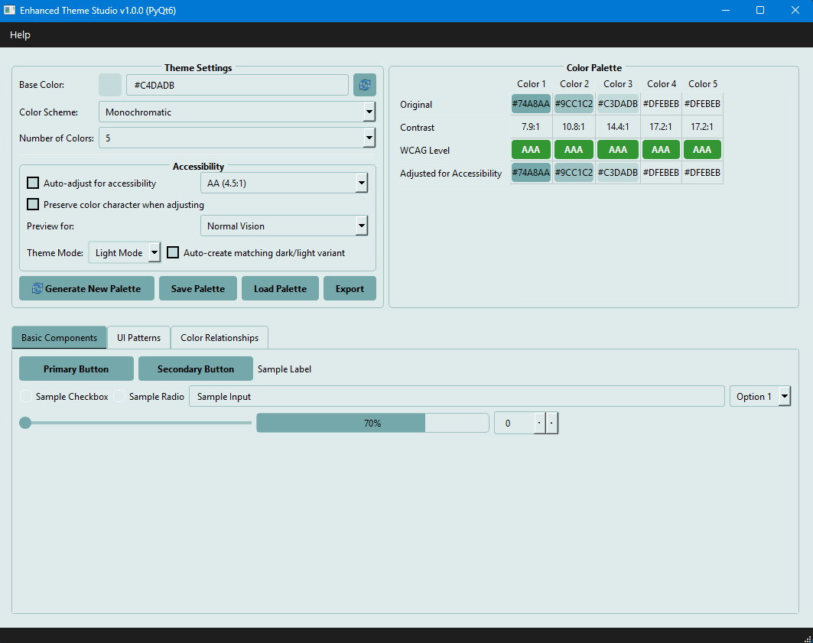

# Enhanced Theme Studio

A powerful color theme generator with accessibility features, built with PyQt6.



## Features

- Generate color palettes based on color theory (Monochromatic, Analogous, Complementary, etc.)
- WCAG compliance checking for accessibility
- Colorblindness simulation preview
- Dark/Light mode toggle with auto-adjustment
- Export themes to multiple formats:
  - CSS Variables
  - QSS (Qt Style Sheets)
  - Tailwind Config
  - JSON
  - SVG Color Palette
- Save and load color palettes
- Live preview of UI components with the generated theme

## Installation

### From Executable (Windows)

Download the latest release from the [Releases](https://github.com/Soundchazer2k/enhanced-theme-studio/releases) page.

### From Source

### From Source

Requires Python 3.8 or higher.

1. Clone this repository:
   ```
   git clone https://github.com/Soundchazer2k/enhanced-theme-studio.git
   cd enhanced-theme-studio
   ```

2. Create a virtual environment and install dependencies:
   ```
   python -m venv venv
   # On Windows
   venv\Scripts\activate
   # On macOS/Linux
   source venv/bin/activate
   
   pip install -r requirements.txt
   ```

3. Run the application:
   ```
   python enhanced_theme_generator.py
   ```

## Building from Source

To create an executable:

```
python -m PyInstaller pyinstaller.spec
```

Or use the provided batch script on Windows:

```
package_app_debug.bat
```

## Usage

1. Select a base color using the color picker
2. Choose a color scheme type (Monochromatic, Analogous, etc.)
3. Set the number of colors in your palette
4. Enable WCAG compliance if needed
5. Preview the theme in the UI components section
6. Export the theme in your preferred format

## Accessibility Features

- WCAG AA (4.5:1) and AAA (7:1) compliance checking
- Color adjustments to meet contrast requirements
- Colorblindness simulation for:
  - Protanopia (red-blind)
  - Deuteranopia (green-blind)
  - Tritanopia (blue-blind)
  - Grayscale

## License

This project is licensed under the GNU General Public License v3.0 - see the [LICENSE](LICENSE) file for details.

## Contributing

Contributions are welcome! Please feel free to submit a Pull Request.

1. Fork the repository
2. Create your feature branch (`git checkout -b feature/amazing-feature`)
3. Commit your changes (`git commit -m 'Add some amazing feature'`)
4. Push to the branch (`git push origin feature/amazing-feature`)
5. Open a Pull Request

## Acknowledgments

- **Core Libraries**
  - [PyQt6](https://www.riverbankcomputing.com/software/pyqt/) for the UI framework
  - [NumPy](https://numpy.org/) for color calculations and transformations
  - [Pillow](https://python-pillow.org/) for image processing in the icon creator

- **Standards and Resources**
  - [WCAG Guidelines](https://www.w3.org/WAI/standards-guidelines/wcag/) for accessibility standards
  - [Colorblindness simulation algorithms](https://www.color-blindness.com/) for accurate color vision deficiency previews
  - Color theory principles from various design resources

- **Tools**
  - [PyInstaller](https://www.pyinstaller.org/) for creating standalone executables
  - [GitHub](https://github.com/) for hosting and version control

- **Development Approach**
  - AI-assisted development with LLM code generation
  - "Vibe coding" methodology which prioritizes user experience and accessibility

# Copyright (C) 2024 Soundchazer2k

© 2024 Soundchazer2k. All rights reserved.